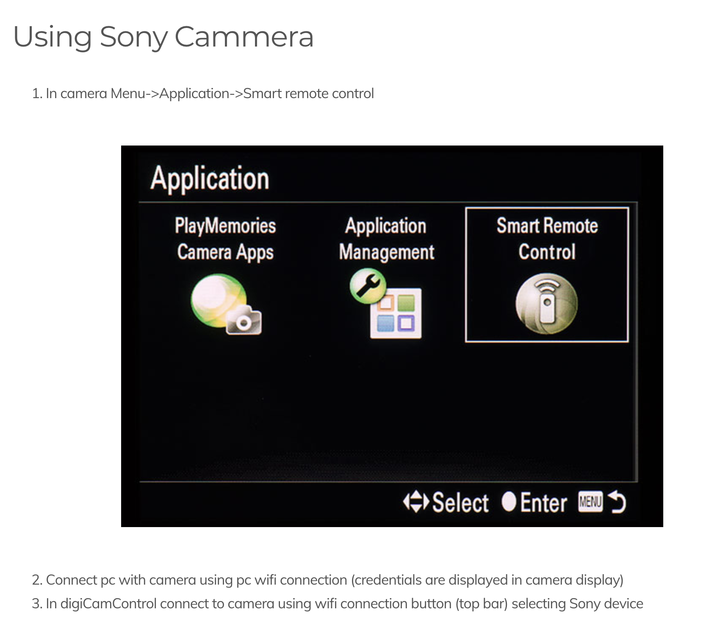
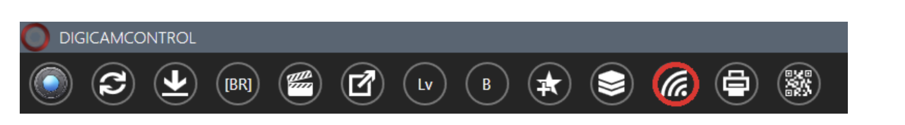
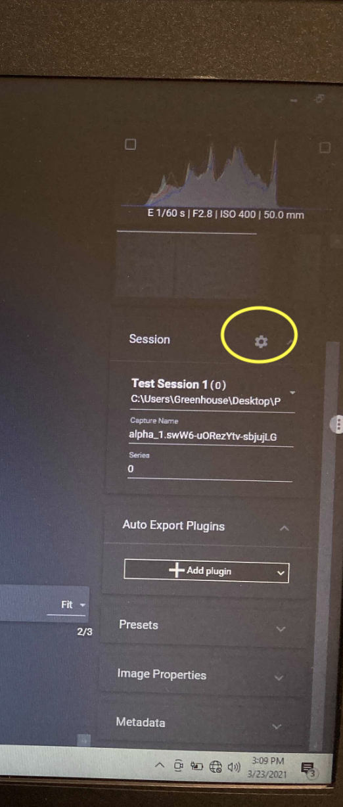
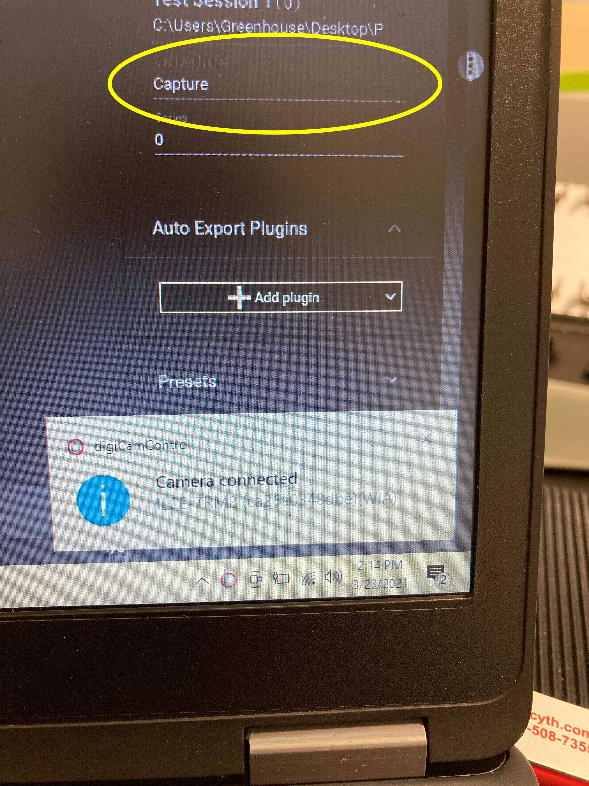
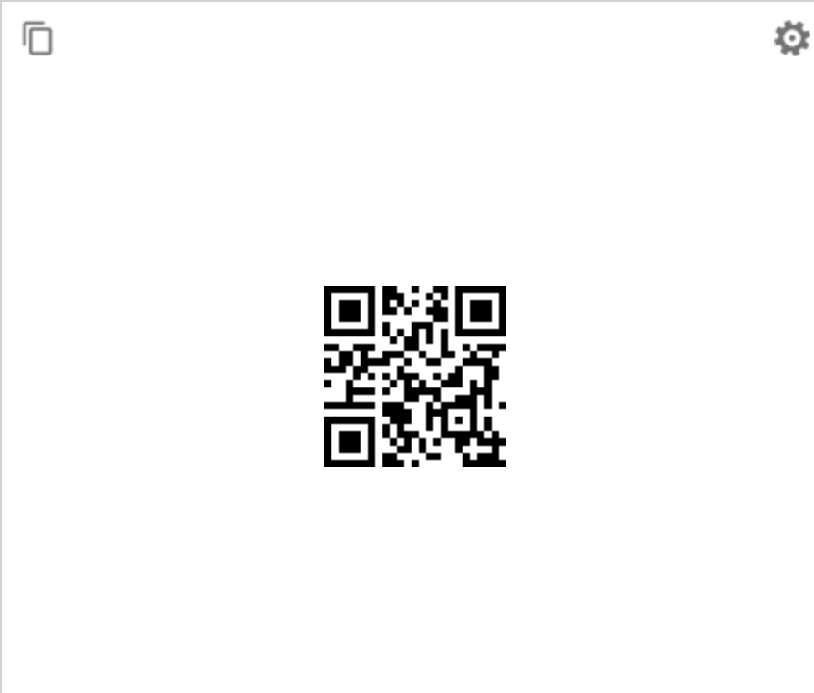
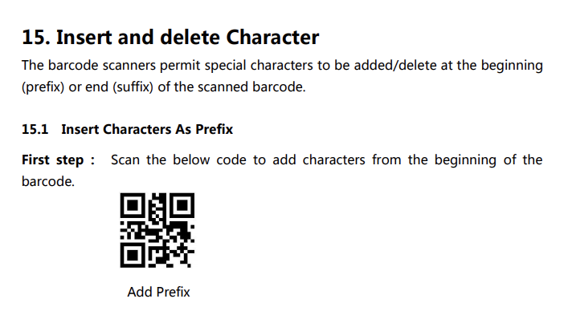
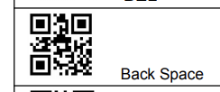
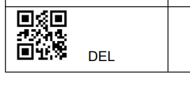

# DSLR camera x barcode imaging guide
Control a Sony A7RII camera (normal DSLR camera) from a Windows computer and integrate with barcode scanning to image some artifacts at higher throughput / productivity. Suppose you had barcode or QR code labels for each of your artifacts (plants, in our case). This guide will allow you to set the filename of each image as the value scanned from the label.

# Hardware
- Sony A7RII camera
- Windows computer
- Handheld barcode or QR code scanner. We use this one: https://www.amazon.com/REALINN-Wireless-Rechargeable-Automatic-Warehouse/dp/B07W5Q48M5/

# Original guide (with DigiCam)

1. Download http://digicamcontrol.com/ onto Windows computer. It's free and open source.

2. To connect your Sony camera, follow the steps given by http://digicamcontrol.com/doc/userguide/interface/wifi:

The wifi icon in the toolbar (from their step 3) looks like this:

As far as DigiCam is concerned, you can only connect via Wifi and [not via microUSB-USB](http://digicamcontrol.com/phpbb/viewtopic.php?f=3&t=4864).

3. Create a session. Then on the sidebar to the right open the session settings:

Change the filename template. Delete the preexisting template and instead make the template solely out of "Capture Name". Save.

4. Now, prior to each time you press capture from the computer you can set the image filename from the "Capture Name" input box:

What you should do is click into this area as if you were about to type some text. Instead of typing, have your handheld scanner plugged into the computer and scan your code. The value will be input for you, as the scanner acts as a USB keyboard. For instance, you could scan this:

Presumably it would be on some label you printed. Now push capture. And that's it! You should be able to see the file saved on your computer with its name as what you scanned. 

# Programming the REALINN scanner
You'll notice that every time you have to take a new picture you will need to delete the "Capture Name" before scanning your new code. If you're using the REALINN brand scanner, you can program it to automatically delete all of the preexisting text in the textbox before it enters your scanned value. 

The way we can do this is by programming the scanner to have backspaces and deletions as "prefixes" that happen ahead of the scan. Steps:

1. Scan "add prefix character"

2. Scan "back space" 30 times

3. Scan "Del" 30 times

4. Test that this works by clicking anywhere into the textbox with preexisting text, scan something new, and ensure that the old text has been replaced with the new text. 

The excessive back spaces ensure any characters to the left of your cursor are removed, and the excessive Dels ensure any characters to the right of your cursor are removed. 30 times for each (for a total of a 60-char prefix) may possibly be too long for the REALINN scanner to handle, so you may want to do less or play around with these configurations. Refer to the [manual](https://github.com/Salk-Harnessing-Plants-Initiative/DSLR-barcode-imaging-guide/blob/main/RL6200W%20Manual%20V1.0.pdf) for more information or to reset your scanner's configuration programming. 

# Alternative camera control software (Windows or MacOS)
We didn't have time to explore this, but you may want to consider Sony Imaging Edge Desktop as an alternative to Digicam if you have issues. Sony Imaging Edge Desktop is available on both Windows and MacOS. As a plus, it's capable of using a USB connection (microUSB to USB) rather than only Wifi, so your Internet connection isn't tied up. 

- Sony Imaging Edge Desktop: https://imagingedge.sony.net/en-us/ie-desktop.html
- Helpful video, especially steps required to configure your camera: https://www.youtube.com/watch?v=NCbt7GujmE4

# And how do we make QR code labels in our lab?
We use a BradyID labelprinter and import via spreadsheet in the label printing software. It's a lot like Avery address label printing if you've every had to mail out holiday cards. You can pick the column you want to encode into the QR code or barcode. 

See an example spreadsheet [here](https://github.com/Salk-Harnessing-Plants-Initiative/DSLR-barcode-imaging-guide/blob/main/example_spreadsheet_for_printing_labels.xlsx).
